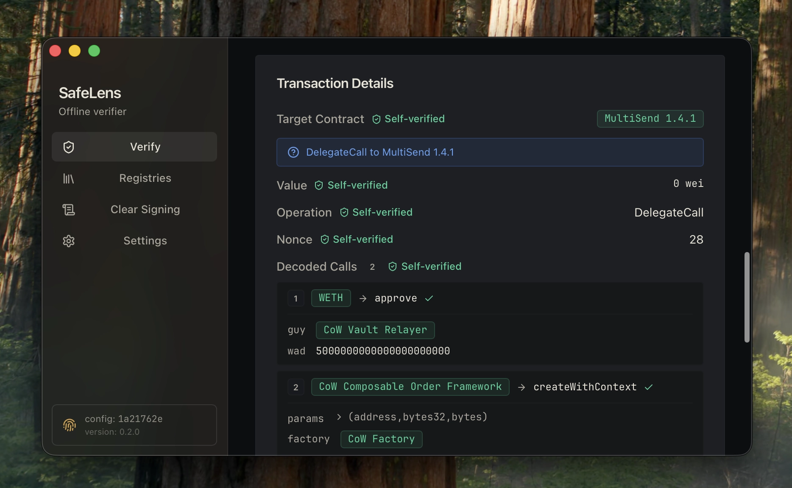
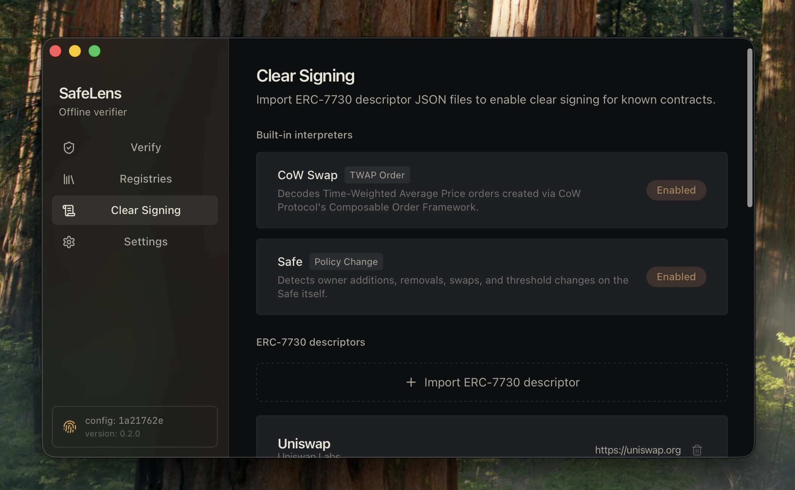
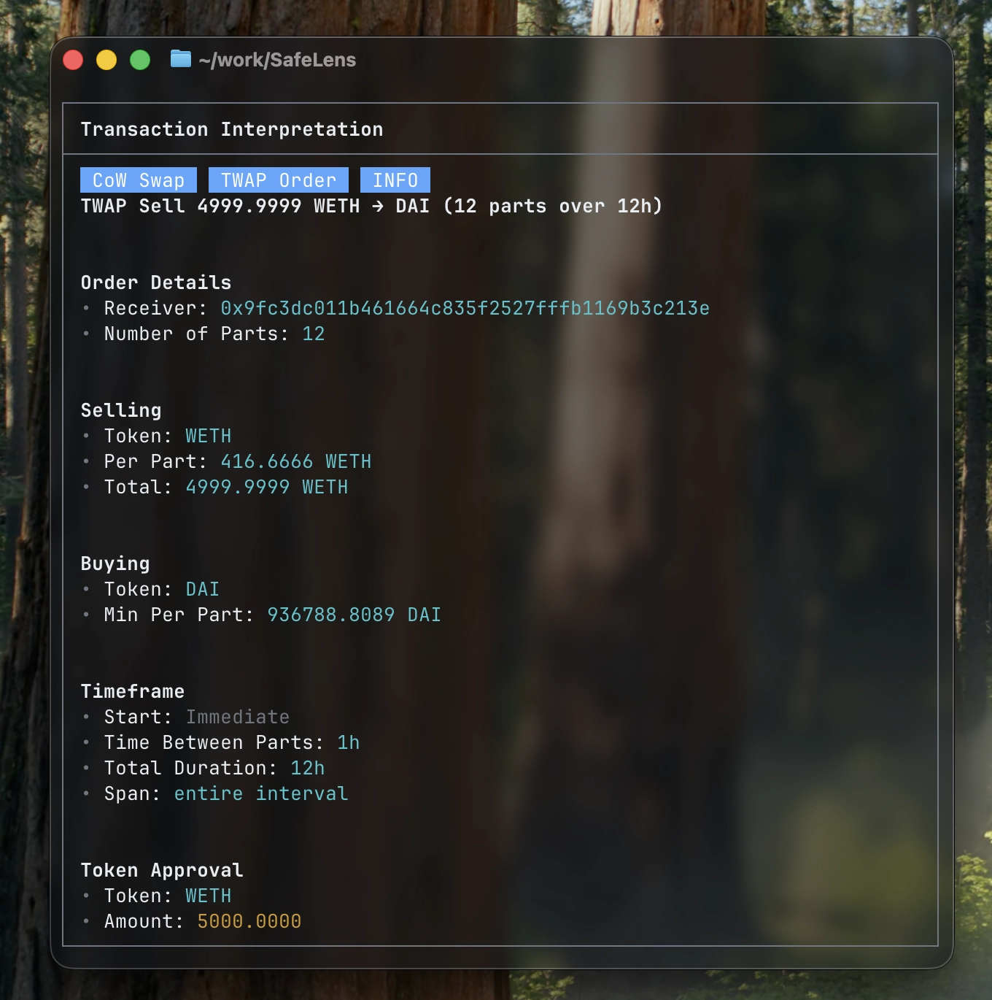
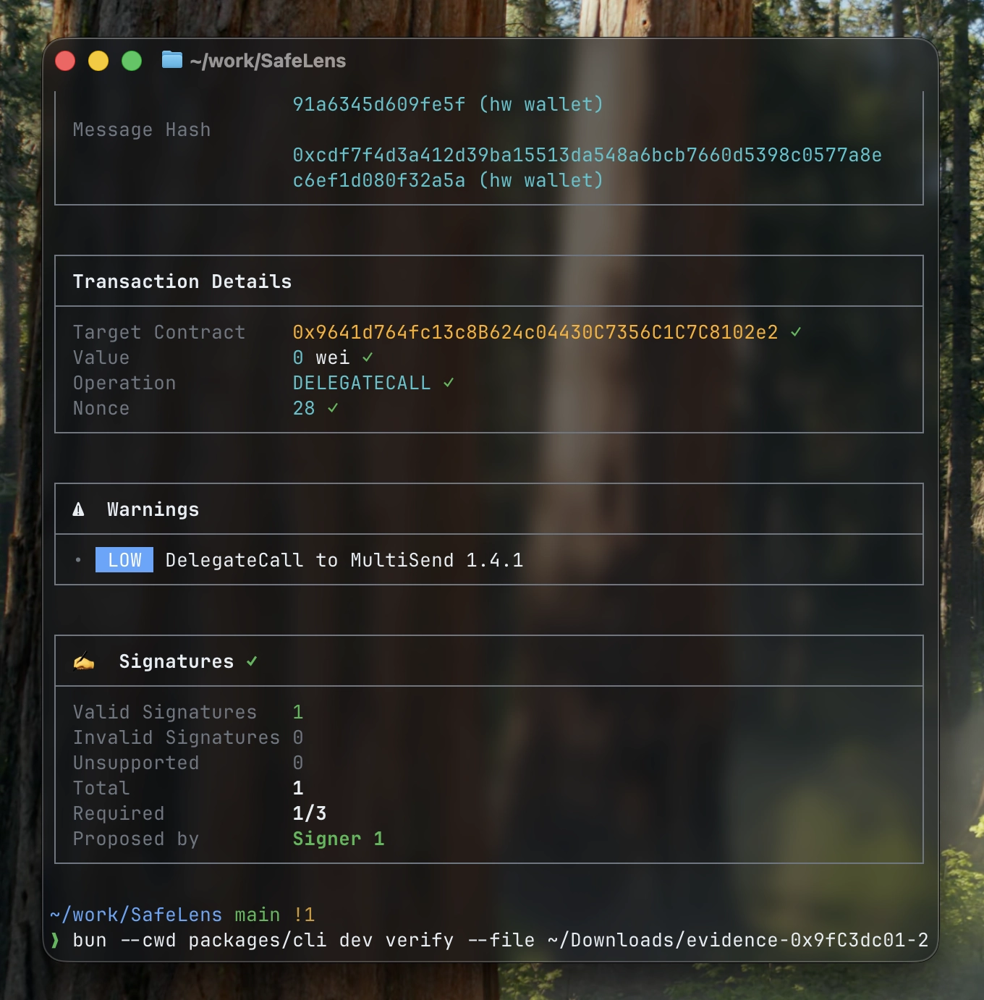
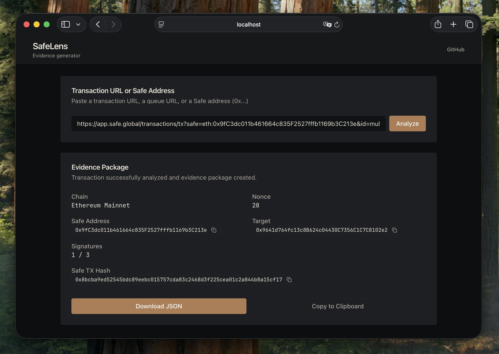

<p align="center">
  
</p>

<h1 align="center">SafeLens</h1>

<p align="center">
  Offline transaction verifier for Safe multisig wallets with ERC-7730 clear signing.
</p>

<p align="center">
  <a href="https://safelens.lfg.rs/">Generator</a> · Desktop App · CLI
</p>

<p align="center">
  
</p>

## What it does

SafeLens generates and verifies evidence packages for Gnosis Safe multisig transactions. Paste a Safe transaction URL into the [generator](https://safelens.lfg.rs/), download the `evidence.json`, then verify signatures and hashes offline using the desktop app or CLI.

- **Generate** an `evidence.json` package from any Safe transaction URL
- **Verify** signatures, hashes, and decoded calldata locally with zero network access
- **Clear signing** via built-in and ERC-7730 interpreters for human-readable transaction details

## Trust model

The desktop verifier ships with `connect-src 'none'` CSP and no shell-open capability, it cannot make network requests during verification. All crypto runs locally using bundled libraries. See [`TRUST_ASSUMPTIONS.md`](TRUST_ASSUMPTIONS.md) for the full model.

## Quick start

Generate an evidence package at [safelens.lfg.rs](https://safelens.lfg.rs/), or via CLI:

```bash
bun --cwd packages/cli dev analyze "https://app.safe.global/transactions/tx?..." --out evidence.json
```

Verify offline:

```bash
bun --cwd packages/cli dev verify --file evidence.json
```

## Screenshots

<details>
<summary>Desktop App</summary>

#### Transaction Details


#### ERC-7730 Clear Signing Interpreters


</details>

<details>
<summary>CLI</summary>

#### Transaction Interpretation


#### Verification


</details>

<details>
<summary>Generator</summary>

#### Evidence Package


</details>

## Development

<details>
<summary>Project structure, setup, and build instructions</summary>

### Structure

| Path | Description |
|------|-------------|
| `apps/generator` | Next.js webapp, creates and exports `evidence.json` |
| `apps/desktop` | Tauri + Vite desktop app, verifies evidence offline |
| `packages/core` | Shared validation, hashing, signature verification, warnings |
| `packages/cli` | CLI wrapper over core logic |

### Setup

Requires [Bun](https://bun.sh).

```bash
bun install
```

### Run

```bash
bun run dev          # generator at localhost:3000
bun run dev:tauri    # desktop app (full Tauri shell)
bun run dev:desktop  # desktop frontend only (no Tauri)
```

### Build

```bash
bun run build        # generator + desktop frontend assets
bun run build:tauri  # full desktop distributable
```

### Settings

Settings are JSON (address book and contract registry).

- CLI: `~/.safelens/settings.json`
- Desktop: app data folder

```bash
bun --cwd packages/cli dev settings init   # initialize settings
bun --cwd packages/cli dev sources         # show verification sources
```

Generator rollout flags:

- `NEXT_PUBLIC_ENABLE_LINEA_CONSENSUS=1` enables experimental Linea consensus envelope generation.
- Default is disabled so Linea remains an explicit partial-support path until full verifier rollout is complete.
- When disabled, generated partial packages include explicit reason `consensus-mode-disabled-by-feature-flag`.
- Verification reports surface the same reason in consensus trust summaries, instead of collapsing to a generic missing-proof message.
- Desktop `ExecutionSafetyPanel` now reuses that summary for the collapsed consensus row when no proof is present.
- OP Stack/Linea packages now preserve explicit `*-consensus-verifier-pending` trust reasons before desktop verification runs, avoiding generic "missing consensus result" messaging.
- Beacon light-client fetch remains beacon-only; OP Stack/Linea are tracked as separate execution-envelope consensus modes.
- OP Stack/Linea envelope generation now enforces `blockTag: finalized` to keep export-time consensus claims aligned with verifier finality requirements.
- CLI `analyze` now attempts consensus enrichment where supported and always stamps `exportContract` with explicit machine-readable partial/failure reasons.
- Export contracts now treat OP Stack/Linea consensus without an RPC URL as `missing-consensus-proof` (configuration gap), not `consensus-proof-fetch-failed` (runtime failure).
- Verification reports now preserve `invalid-proof-payload` as an explicit consensus trust reason, instead of collapsing malformed envelope failures into a generic invalid-result message.
- Verification reports now preserve `invalid-expected-state-root` as an explicit consensus trust reason when policy root formatting is invalid.
- Desktop non-beacon verification now enforces package `network` metadata consistency with envelope `chainId` (`opstack`: `10->optimism`, `8453->base`; `linea`: `59144->linea`) and emits deterministic `unsupported-network` on mismatch.
- OP Mainnet envelope metadata now uses canonical `network: "optimism"`; desktop verifier still accepts legacy `network: "oeth"` for backward compatibility.
- Simulation results now include optional `blockTimestamp`; desktop `ExecutionSafetyPanel` freshness copy shows block time and age against local time when present.
- Desktop network support badges are now package-aware: if a package omits simulation or consensus artifacts, `ExecutionSafetyPanel` shows `Partial` with explicit helper text instead of a capability-only `Full` label.
- `ExecutionSafetyPanel` now maps known consensus verifier `error_code` values to concise, actionable trust text (with raw verifier text fallback for unknown codes) to keep warning/error messaging deterministic and user-focused.

### Cleanup

```bash
rm -rf apps/generator/.next apps/desktop/src-tauri/target apps/desktop/src-tauri/.tauri apps/desktop/src-tauri/Cargo.lock .opencode
```

</details>
